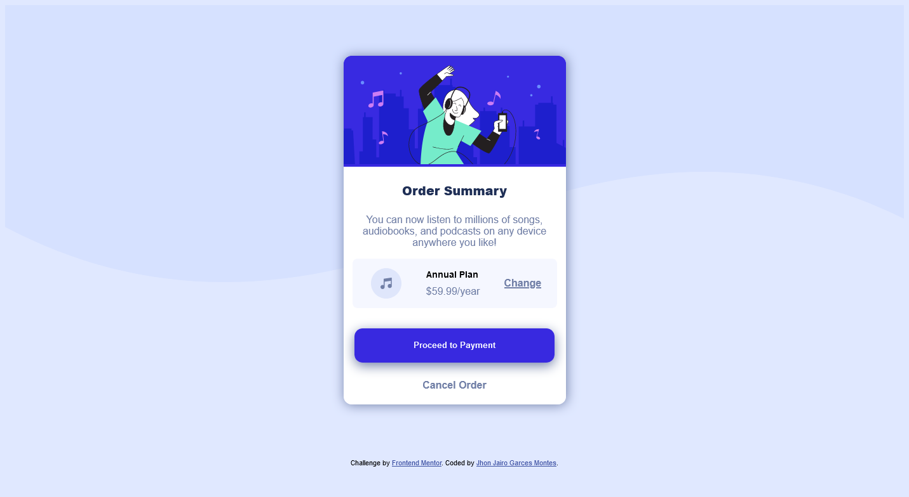

# Order summary card component 

## Table of contents

- [Overview](#overview)
  - [The challenge](#the-challenge)
  - [Screenshot](#screenshot)
- [My process](#my-process)
  - [Built with](#built-with)
  - [What I learned](#what-i-learned)
  - [Continued development](#continued-development)
- [Author](#author)

## Overview

### The challenge

Users should be able to:

- See hover states for interactive elements

### Screenshot

## My process
It was quite easy to folllow and to do still need to work on my CSS skills.
### Built with

- Semantic HTML5 markup
- CSS custom properties
- Flexbox
- CSS Grid
- Mobile-first workflow

### What I learned

Learn CSS is about practice and not taking it for granted, how to center a div is really important, being creative and know how to work with what you have; still have some areas of improvement 

### Continued development

next, I want to keep learning about CSS maybe implement this card component on ReactJS and styled it with styled components in the future

## Author

- Website - [Jhon Jairo Garces  Montes](https://jhongarces.dev)
